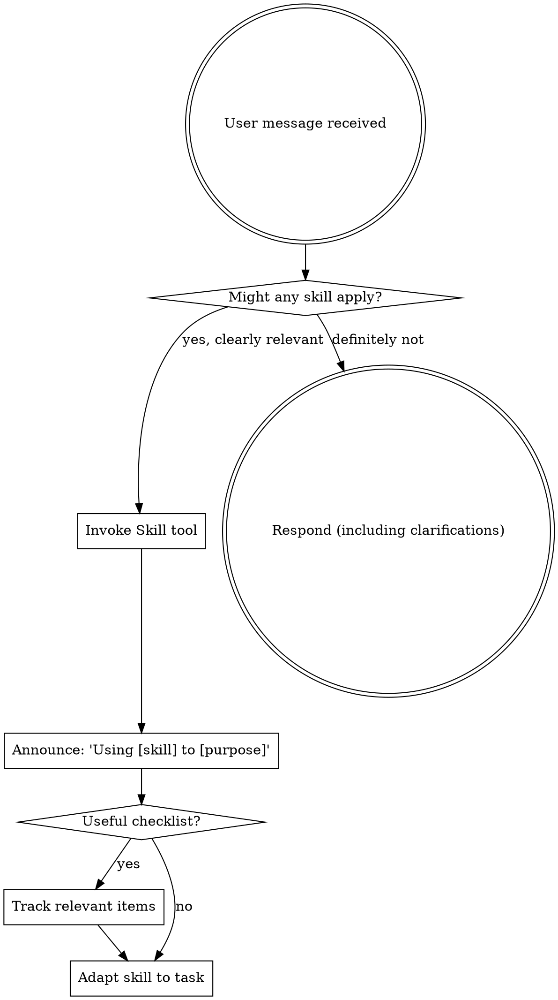

<SUBAGENT-STOP>
If you were dispatched as a subagent to execute a specific task, skip this skill.
</SUBAGENT-STOP>

<SKILL-SELECTION-GUIDANCE>
Load a skill when it clearly matches the task or the user names it. Prefer the smallest set that materially improves the work. Do not delay a clarification, harmless inspection, or obvious direct action merely to search for marginally related skills. If a suggested skill is unavailable, continue with the best available method and report the limitation when material.
</SKILL-SELECTION-GUIDANCE>

## Workflow-First Sequence

For each non-trivial primary task, use this order:

1. Determine the applicable workflow from the requested outcome, scope, and observed target content.
2. Inspect the active skill inventory and choose the smallest necessary skill set.
3. Initialize the native `todo` for multi-step work and map the selected workflow, skills, user requirements, and verification.
4. Load each selected skill before the step that uses it.
5. Fork multiple independent workstreams with native `task` when useful; keep integration and final verification with the parent.
6. Execute and update the TODO through completion.

A native `skill-prompt` body followed by `Skill: <path>` means the skill has already been
loaded in the current context. Follow it directly and do not read the same skill again.
OMP Enhancer Core does not choose or autoload a routed skill
bundle; the main agent owns selection from the active inventory.

`writing.pending` defers language-specific skill selection until source prose
is visible; it does not mean that writing needs no skill. Read the exact target
once, determine the language from the body, and then continue skill selection
before revising or reviewing. A bounded English review uses `writing-review`,
a broad document or project review adds `writing-checkers`, and a direct local
English LaTeX prose polish uses `writing-review`. A direct local English
Markdown revision uses `writing-markdown-helper`; use the corresponding
Chinese skills for Chinese source text.

Memory, `recall`, `learn`, general model ability, and `manage_skill` provide or
capture context but do not replace workflow selection or loading a task skill.
Use `learn` or `manage_skill` during the primary task only when the user
explicitly asks for capture. During a host `autolearn-nudge` after delivery,
capture only genuinely reusable knowledge, do not resume the primary task or
reread routed skills, and do not duplicate an already loaded installed skill.

This sequence is guidance rather than an execution or completion gate. If a
needed skill is unavailable, make at most one targeted resolution attempt,
continue with the best available method, and report the limitation when
material.

## Instruction Priority

Superpowers skills override default system prompt behavior, but **user instructions always take precedence**:

1. **User's explicit instructions** (CLAUDE.md, GEMINI.md, AGENTS.md, direct requests) — highest priority
2. **Superpowers skills** — override default system behavior where they conflict
3. **Default system prompt** — lowest priority

If CLAUDE.md, GEMINI.md, or AGENTS.md says "don't use TDD" and a skill says "always use TDD," follow the user's instructions. The user is in control.

## How to Access Skills

**In Claude Code:** Use the `Skill` tool. When you invoke a skill, its content is loaded and presented to you—follow it directly. Never use the Read tool on skill files.

**In Copilot CLI:** Use the `skill` tool. Skills are auto-discovered from installed plugins. The `skill` tool works the same as Claude Code's `Skill` tool.

**In Gemini CLI:** Skills activate via the `activate_skill` tool. Gemini loads skill metadata at session start and activates the full content on demand.

**In other environments:** Check your platform's documentation for how skills are loaded.

## Platform Adaptation

Skills use Claude Code tool names. Non-CC platforms: see `references/copilot-tools.md` (Copilot CLI), `references/codex-tools.md` (Codex) for tool equivalents. Gemini CLI users get the tool mapping loaded automatically via GEMINI.md.

# Using Skills

## The Rule

**Invoke explicitly requested and clearly relevant skills before the work they guide.** A marginal match is not a precondition for answering or acting. If an invoked skill turns out to be wrong for the situation, set it aside and continue.

## Common Skill-Selection Mistakes

These thoughts are useful prompts to reconsider, not reasons to halt unrelated work:

| Thought | Reality |
|---------|---------|
| "This is a simple question" | Usually answer directly unless a named or clearly relevant skill improves accuracy. |
| "I need more context first" | Ask a necessary clarification or perform safe inspection; skill discovery must not block it. |
| "Let me explore the codebase first" | A focused read-only inspection is often the right first step. |
| "I remember this skill" | Re-read it when the current version materially affects the workflow. |
| "The skill is overkill" | Use a smaller workflow when the full skill would add ceremony without value. |
| "A skill is unavailable" | Continue best effort and report the limitation when material. |

## Skill Priority

When multiple skills could apply, use this order:

1. **Process skills first** (brainstorming, debugging) - these determine HOW to approach the task
2. **Implementation skills second** (frontend-design, mcp-builder) - these guide execution

"Let's build X" → brainstorming first, then implementation skills.
"Fix this bug" → debugging first, then domain-specific skills.

## Skill Types

**Structured** (TDD, debugging): Preserve the evidence-seeking principles while adapting sequence and depth to the user request, repository, and available runtime.

**Flexible** (patterns): Adapt principles to context.

The skill itself tells you which.

## User Instructions

Instructions say both what outcome is wanted and which constraints matter. Skills provide workflow options; they do not override an explicit direct request or create a new approval requirement.
